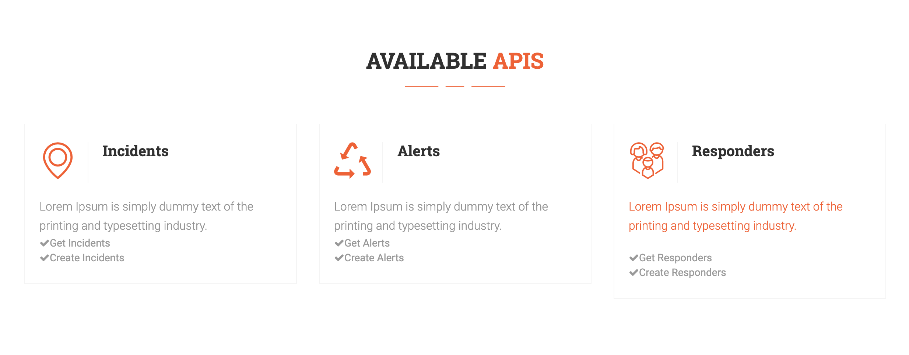
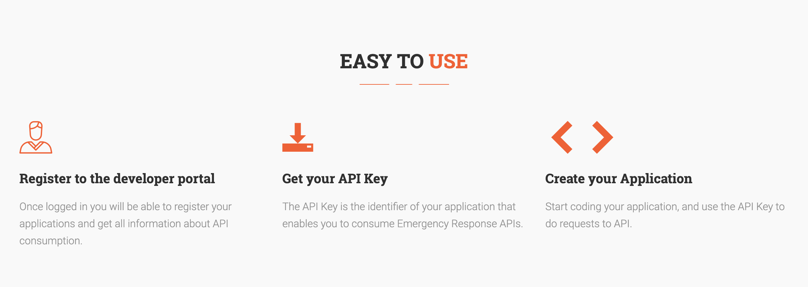
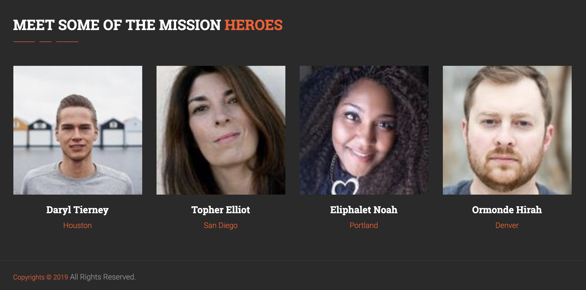

= Developer Portal 

== html-version 

This is just a quick way to validate the layout/idea, to run just open the index.html.

image::images/developer-portal-layout-1.png[]

image::images/developer-portal-layout-4.png[]

